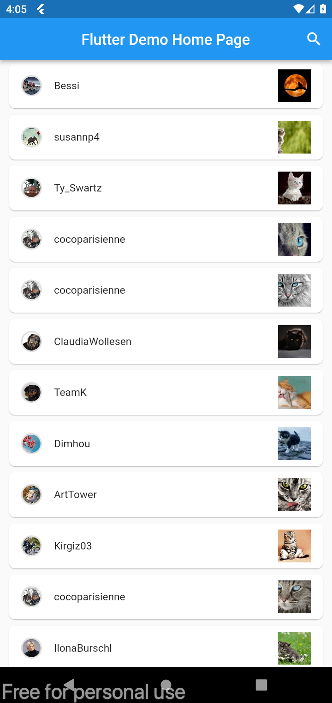
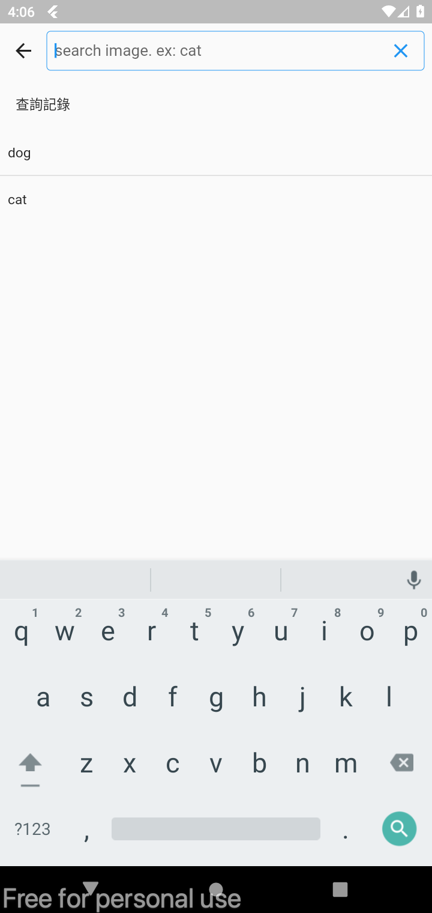

# flutter_pixabay

第一個 Flutter 練習專案, 實作一個搜尋圖片的 APP.
感謝由 [Pixabay API](https://pixabay.com/api/docs/) 提供免費API.

## 練習目標

### 大方向

- 製作一套基本APP 功能: 從API request 到UI 顯示讓User 互動
- dart 語法學習
- 熟悉flutter 框架
- 熟悉flutter 常用套件
- flutter 常用 design pattern

### 細項

1. 常用的Widget -> `Col`, `Row`, `Image`, `Text`, `ListView`, `TextField`...
2. 常用的 UI 操作 -> ImageShape, PlaceHolder, onScrollBottom, ...
3. 基本的 API request -> Doi, Retrofit
4. Di -> get_it
5. 頁面router 操作
6. design pattern: Bloc
7. element tree, key, render 之間的關係.
8. Alice tools
9. flavor 切分 prod/dev environment & update DI with environment.
10. Use imageNetworkCache.

## [ChangeLog](changelog.md)

## Screenshot

|                              |                                  |
| ---------------------------- | -------------------------------- |
|  |  |
